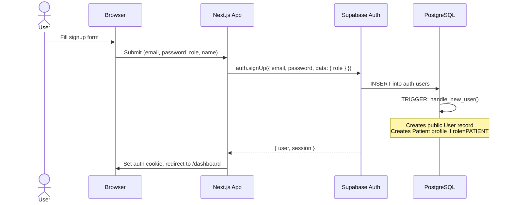
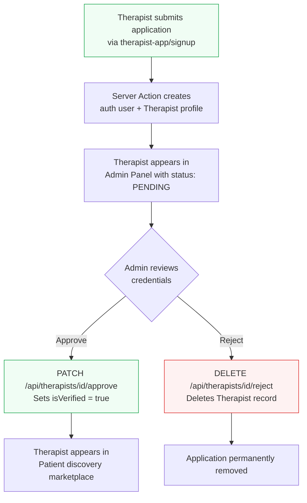

# 📖 The Blissful Station — Technical Documentation

> A multi-portal SaaS platform for mental wellness, connecting patients with verified therapists through a curated, admin-managed marketplace.

---

## Table of Contents

1. [Architecture Overview](#1-architecture-overview)
2. [Monorepo Structure](#2-monorepo-structure)
3. [Technology Stack](#3-technology-stack)
4. [Database Schema](#4-database-schema)
5. [Authentication System](#5-authentication-system)
6. [The Three Portals](#6-the-three-portals)
7. [Admin Verification Workflow](#7-admin-verification-workflow)
8. [Supabase Client Strategy](#8-supabase-client-strategy)
9. [Design System](#9-design-system)
10. [Environment Variables](#10-environment-variables)
11. [Running Locally](#11-running-locally)
12. [Known Limitations & Future Work](#12-known-limitations--future-work)

---

## 1. Architecture Overview

```
┌─────────────────────────────────────────────────────────────────┐
│                      Supabase (Cloud BaaS)                      │
│  ┌──────────────┐  ┌──────────────┐  ┌────────────────────────┐ │
│  │  Auth Service │  │  PostgreSQL  │  │  Row Level Security    │ │
│  │  (JWT-based)  │  │  (Database)  │  │  (RLS Policies)        │ │
│  └──────┬───────┘  └──────┬───────┘  └────────────────────────┘ │
└─────────┼──────────────────┼────────────────────────────────────┘
          │                  │
          │    Supabase SSR   │
          │    (@supabase/ssr)│
          ▼                  ▼
┌──────────────┐  ┌──────────────┐  ┌──────────────┐
│ Patient App  │  │ Therapist App│  │ Admin Panel  │
│  :3000       │  │  :3001       │  │  :3002       │
│  Next.js 15  │  │  Next.js 15  │  │  Next.js 15  │
│  (App Router)│  │  (App Router)│  │  (App Router)│
└──────────────┘  └──────────────┘  └──────────────┘

┌──────────────────────────────────────────────────────────────────┐
│                    Backend (NestJS) — Scaffolded                  │
│  Passport JWT Strategy  •  Role Guards  •  Prisma ORM            │
│  (Future API layer for business logic)                           │
└──────────────────────────────────────────────────────────────────┘
```

The platform is a **multi-portal monorepo** with three independent Next.js 15 applications sharing a single Supabase project as the backend. Each app targets a specific user role:

| Portal | Port | Target User | Key Feature |
|--------|------|-------------|-------------|
| `patient-app` | 3000 | Patients | Browse therapists, book sessions |
| `therapist-app` | 3001 | Therapists | Manage practice, view patients |
| `admin-panel` | 3002 | Admins | Verify therapists, platform analytics |

---

## 2. Monorepo Structure

```
blissfulsaas/
├── patient-app/              # Patient-facing portal
│   ├── src/
│   │   ├── app/
│   │   │   ├── auth/signout/route.ts       # Sign-out API route
│   │   │   ├── dashboard/                  # Protected dashboard
│   │   │   │   ├── layout.tsx              # Auth guard + sidebar
│   │   │   │   ├── page.tsx                # Dashboard home
│   │   │   │   ├── discover/page.tsx       # Therapist marketplace
│   │   │   │   └── therapist/[id]/page.tsx # Therapist detail
│   │   │   ├── login/page.tsx              # Login page
│   │   │   ├── signup/page.tsx             # Patient registration
│   │   │   ├── globals.css                 # Design tokens
│   │   │   └── page.tsx                    # Landing page
│   │   ├── components/
│   │   │   └── SignOutButton.tsx            # Client-side logout
│   │   └── lib/
│   │       ├── supabase.ts                 # Browser client
│   │       └── supabase/server.ts          # Server client
│   └── .env.local                          # Environment variables
│
├── therapist-app/            # Therapist-facing portal
│   ├── src/
│   │   ├── app/
│   │   │   ├── auth/signout/route.ts       # Sign-out API route
│   │   │   ├── dashboard/                  # Protected dashboard
│   │   │   │   ├── layout.tsx              # Auth guard + sidebar
│   │   │   │   ├── page.tsx                # Dashboard home
│   │   │   │   └── session/[id]/page.tsx   # Session detail
│   │   │   ├── login/page.tsx              # Login page
│   │   │   ├── signup/
│   │   │   │   ├── page.tsx                # Signup form (client)
│   │   │   │   └── actions.ts              # Server action (profile creation)
│   │   │   ├── globals.css                 # Design tokens
│   │   │   └── page.tsx                    # Landing page
│   │   ├── components/
│   │   │   └── SignOutButton.tsx
│   │   └── lib/
│   │       ├── supabase.ts                 # Browser client
│   │       └── supabase/server.ts          # Server client + Admin client
│   └── .env.local
│
├── admin-panel/              # Internal admin portal
│   ├── src/
│   │   ├── app/
│   │   │   ├── api/therapists/[id]/
│   │   │   │   ├── approve/route.ts        # PATCH: verify therapist
│   │   │   │   └── reject/route.ts         # DELETE: reject therapist
│   │   │   ├── auth/signout/route.ts       # Sign-out API route
│   │   │   ├── dashboard/
│   │   │   │   ├── layout.tsx              # Admin auth guard + sidebar
│   │   │   │   ├── page.tsx                # Stats overview
│   │   │   │   └── therapists/
│   │   │   │       ├── page.tsx            # Provider network list
│   │   │   │       └── [id]/
│   │   │   │           ├── page.tsx        # Therapist detail
│   │   │   │           ├── ApproveButton.tsx
│   │   │   │           └── RejectButton.tsx
│   │   │   ├── login/page.tsx              # Admin login
│   │   │   └── globals.css                 # Design tokens
│   │   ├── components/
│   │   │   └── SignOutButton.tsx
│   │   └── lib/
│   │       ├── supabase.ts                 # Browser client
│   │       └── supabase/server.ts          # Server + Admin client
│   └── .env.local
│
├── backend/                  # NestJS API (scaffolded)
│   ├── prisma/
│   │   └── schema.prisma                   # Database schema (source of truth)
│   └── src/
│       └── auth/
│           ├── auth.module.ts              # Passport module
│           ├── jwt.strategy.ts             # Supabase JWT validation
│           └── roles.guard.ts              # RBAC guard decorator
│
├── promote_admin.sql         # SQL script to promote user to admin
├── .gitignore                # Excludes secrets, node_modules, .next
└── README.md
```

---

## 3. Technology Stack

| Layer | Technology | Purpose |
|-------|-----------|---------|
| **Frontend** | Next.js 15 (App Router) | Server components, routing, SSR |
| **Styling** | Tailwind CSS v4 | Utility-first CSS with design tokens |
| **UI Components** | shadcn/ui (partial) | Button, Card, Input primitives |
| **Icons** | Lucide React | Consistent, lightweight icon set |
| **Auth** | Supabase Auth | Email/password authentication |
| **Database** | Supabase PostgreSQL | Managed Postgres with RLS |
| **ORM** | Prisma | Schema definition and migrations |
| **Backend API** | NestJS (scaffolded) | Future REST API with guards |
| **Fonts** | Inter + Manrope | System sans-serif + display heading |

---

## 4. Database Schema

The database schema is defined in `backend/prisma/schema.prisma` and managed via Supabase PostgreSQL.

### Entity Relationship Diagram

```mermaid
erDiagram
    User ||--o| Patient : "has profile"
    User ||--o| Therapist : "has profile"
    User ||--o| Admin : "has profile"

    User {
        UUID id PK "Matches auth.users.id"
        String email UK
        Role role "PATIENT | THERAPIST | ADMIN"
        DateTime createdAt
        DateTime updatedAt
    }

    Patient {
        UUID id PK
        UUID userId FK UK
        String firstName
        String lastName
        String phone
        DateTime dateOfBirth
    }

    Therapist {
        UUID id PK
        UUID userId FK UK
        String firstName
        String lastName
        String bio
        String[] specialities
        String videoUrl
        Float hourlyRate
        Boolean isVerified "false by default"
    }

    Admin {
        UUID id PK
        UUID userId FK UK
    }
```

### Key Design Decisions

- **1:1 Role Profiles**: Each `User` has exactly one profile (`Patient`, `Therapist`, or `Admin`). This is enforced by unique constraints on `userId`.
- **UUID Primary Keys**: All IDs use `gen_random_uuid()` and match Supabase's `auth.users.id` format.
- **Cascade Deletes**: Deleting a `User` cascades to their profile.
- **`isVerified` Flag**: Therapists start as unverified and must be approved by an admin.

---

## 5. Authentication System

### 5.1 Auth Provider

All authentication is handled by **Supabase Auth** using email/password credentials. The Supabase client library (`@supabase/ssr`) manages JWT tokens via HTTP-only cookies.

### 5.2 Auth Flow Diagram



### 5.3 Database Trigger — `handle_new_user()`

Located in `backend/supabase_triggers.sql`, this PostgreSQL trigger fires on every new `auth.users` insertion:

```sql
CREATE OR REPLACE FUNCTION public.handle_new_user()
RETURNS trigger AS $$
BEGIN
  -- 1. Always create a public.User record
  INSERT INTO public."User" (id, email, role)
  VALUES (
    new.id,
    new.email,
    CAST(COALESCE(new.raw_app_meta_data->>'role', 'PATIENT') AS public."Role")
  );

  -- 2. If the role is PATIENT, also create a Patient profile
  IF COALESCE(new.raw_app_meta_data->>'role', 'PATIENT') = 'PATIENT' THEN
    INSERT INTO public."Patient" ("userId", "firstName", "lastName")
    VALUES (new.id, new.raw_user_meta_data->>'first_name', new.raw_user_meta_data->>'last_name');
  END IF;

  RETURN new;
END;
$$ LANGUAGE plpgsql SECURITY DEFINER;
```

> **Important**: The trigger only auto-creates `Patient` profiles. Therapist profiles are created explicitly via a **Server Action** (see §5.5 below).

### 5.4 Role-Based Access Control (RBAC)

Each portal enforces access at the **layout level** (Server Components):

| Portal | Guard Location | How It Works |
|--------|---------------|--------------|
| **Patient App** | `dashboard/layout.tsx` | Calls `supabase.auth.getUser()`. Redirects to `/login` if no session. |
| **Therapist App** | `dashboard/layout.tsx` | Same as Patient. No role check (any authenticated user can access). |
| **Admin Panel** | `dashboard/layout.tsx` | Calls `auth.getUser()`, then queries `public.User` via **Admin Client** (Service Role). If `role !== ADMIN`, signs the user out and redirects with an error. |

### 5.5 Therapist Signup — Server Action Pattern

Because Supabase RLS blocks new users from inserting into the `Therapist` table (no policy exists yet), the therapist signup uses a **Next.js Server Action** that bypasses RLS:

```
therapist-app/src/app/signup/
├── page.tsx        ← Client Component (form UI)
└── actions.ts      ← Server Action (uses Service Role key)
```

**Flow:**
1. `page.tsx` collects form data and calls `signUpTherapist()` (Server Action).
2. `actions.ts` uses the **regular client** for `auth.signUp()` (creates auth user + triggers `User` record).
3. `actions.ts` then uses the **Admin client** (Service Role) to `INSERT` into `Therapist` table (bypasses RLS).

### 5.6 Sign-Out Mechanism

Each app has a dedicated API route for sign-out:

```
/auth/signout    (POST)
```

The `SignOutButton` (Client Component) sends a `POST` fetch to this route. The route handler calls `supabase.auth.signOut()` server-side and redirects to `/login`.

This pattern avoids cookie persistence issues that occur when signing out client-side only.

### 5.7 Cookie Isolation

Since all three apps run on `localhost`, they would normally fight over the same Supabase auth cookie. To prevent session conflicts, each app uses a **unique cookie name**:

| App | Cookie Name |
|-----|------------|
| Patient App | `sb-patient-auth-token` |
| Therapist App | `sb-therapist-auth-token` |
| Admin Panel | `sb-admin-auth-token` |

This is configured in both the browser client (`lib/supabase.ts`) and server client (`lib/supabase/server.ts`) via the `cookieOptions.name` parameter.

### 5.8 Admin Promotion

Admins cannot self-register. An existing user must be manually promoted via SQL:

```sql
-- promote_admin.sql
-- Run in Supabase SQL Editor

UPDATE public."User" SET role = 'ADMIN' WHERE id = '<user-uuid>';
INSERT INTO public."Admin" ("userId") VALUES ('<user-uuid>') ON CONFLICT DO NOTHING;
DELETE FROM public."Patient" WHERE "userId" = '<user-uuid>';
DELETE FROM public."Therapist" WHERE "userId" = '<user-uuid>';
```

---

## 6. The Three Portals

### 6.1 Patient App (`:3000`)

| Page | Route | Description |
|------|-------|-------------|
| Landing | `/` | Marketing page with hero, features, CTAs |
| Login | `/login` | Email/password login |
| Signup | `/signup` | Patient registration with name fields |
| Dashboard | `/dashboard` | Protected patient home |
| Discover | `/dashboard/discover` | Browse therapist marketplace (currently static data) |
| Therapist Detail | `/dashboard/therapist/[id]` | View individual therapist profile |

### 6.2 Therapist App (`:3001`)

| Page | Route | Description |
|------|-------|-------------|
| Landing | `/` | Provider-focused marketing page |
| Login | `/login` | Professional login |
| Signup | `/signup` | Application form → creates auth user + Therapist profile |
| Dashboard | `/dashboard` | Protected provider workspace |
| Session Detail | `/dashboard/session/[id]` | Individual session management |

### 6.3 Admin Panel (`:3002`)

| Page | Route | Description |
|------|-------|-------------|
| Login | `/login` | Admin-only terminal login |
| Overview | `/dashboard` | Platform stats: total users, patients, therapists, pending |
| Provider Network | `/dashboard/therapists` | Table of all therapist applications |
| Therapist Detail | `/dashboard/therapists/[id]` | Deep-dive into individual practitioner |
| Approve API | `POST /api/therapists/[id]/approve` | Set `isVerified = true` |
| Reject API | `DELETE /api/therapists/[id]/reject` | Delete Therapist record |

---

## 7. Admin Verification Workflow



### API Endpoints

**Approve** — `PATCH /api/therapists/[id]/approve`
```typescript
// Uses createAdminClient() (Service Role — bypasses RLS)
await supabase.from("Therapist").update({ isVerified: true }).eq("id", id);
```

**Reject** — `DELETE /api/therapists/[id]/reject`
```typescript
// Deletes the Therapist profile (keeps the auth user intact)
await supabase.from("Therapist").delete().eq("id", id);
```

---

## 8. Supabase Client Strategy

Each app maintains **two server-side clients** and **one browser client**:

### Browser Client (`lib/supabase.ts`)
- Used in `"use client"` components (login forms, signout buttons).
- Uses the **anon (publishable) key**.
- Configures a unique cookie name per app.

### Server Client (`lib/supabase/server.ts` → `createClient()`)
- Used in Server Components and API routes.
- Uses the **anon key** with cookie-based session management.
- Respects RLS policies.

### Admin Client (`lib/supabase/server.ts` → `createAdminClient()`)
- Used in Admin Panel and Therapist signup Server Action.
- Uses the **Service Role key** (⚠️ NEVER exposed to the browser).
- **Bypasses ALL RLS policies** — full database access.
- Cookie handlers are no-ops (no session needed for service role).

```typescript
// Admin Client pattern — bypasses RLS
export async function createAdminClient() {
  return createServerClient(
    process.env.NEXT_PUBLIC_SUPABASE_URL!,
    process.env.SUPABASE_SERVICE_ROLE_KEY!,  // ⚠️ Server-only
    {
      cookies: {
        getAll() { return [] },
        setAll() { },
      },
    }
  )
}
```

---

## 9. Design System

The platform uses the **"Blissful Botanical"** design system — a muted dark-green palette inspired by botanical wellness spaces.

### Color Tokens (defined in `globals.css`)

| Token | Hex | Usage |
|-------|-----|-------|
| `--primary` | `#053628` | Deep botanical green — headings, buttons, accents |
| `--primary-foreground` | `#ffffff` | Text on primary backgrounds |
| `--primary-container` | `#214d3e` | Lighter green container |
| `--surface` | `#fbf9f9` | Main background |
| `--surface-container-low` | `#f5f3f3` | Card/input backgrounds |
| `--surface-container-lowest` | `#ffffff` | Elevated cards |
| `--destructive` | `#ba1a1a` | Error states, danger actions |
| `--muted-foreground` | `#414944` | Secondary text |

### Typography

| Font | Variable | Usage |
|------|----------|-------|
| **Inter** | `--font-sans` | Body text, UI labels |
| **Manrope** | `--font-heading` | Headings, display text |

### Design Principles

1. **"No-Line" Architecture**: Minimal use of visible borders. Separation achieved through color contrast and subtle shadows.
2. **Glassmorphism**: Backdrop blur effects on headers and overlays (`backdrop-blur-md`).
3. **Micro-Animations**: Hover states with `translate-y`, `scale`, and `rotate` transforms on interactive elements.
4. **Editorial Typography**: Oversized headings (`text-4xl`+), ultra-wide tracking (`tracking-widest`), uppercase labels.
5. **Super-rounding**: Cards use `rounded-[2.5rem]` to `rounded-[3rem]` for a premium organic feel.

---

## 10. Environment Variables

Each app requires a `.env.local` file in its root:

### Patient App & Therapist App
```env
NEXT_PUBLIC_SUPABASE_URL=https://your-project.supabase.co
NEXT_PUBLIC_SUPABASE_ANON_KEY=sb_publishable_xxxxx
```

### Therapist App (additional)
```env
SUPABASE_SERVICE_ROLE_KEY=eyJhbGciOiJIUzI1NiIsInR5cCI6...  # For profile creation
```

### Admin Panel
```env
NEXT_PUBLIC_SUPABASE_URL=https://your-project.supabase.co
NEXT_PUBLIC_SUPABASE_ANON_KEY=sb_publishable_xxxxx
SUPABASE_SERVICE_ROLE_KEY=eyJhbGciOiJIUzI1NiIsInR5cCI6...  # For admin operations
```

> ⚠️ **Security**: The `SUPABASE_SERVICE_ROLE_KEY` is a master key that bypasses ALL security rules. It must **never** be prefixed with `NEXT_PUBLIC_` and should only be used in server-side code.

---

## 11. Running Locally

### Prerequisites
- Node.js 18+
- npm
- A Supabase project with the database schema and triggers applied

### Setup

```bash
# 1. Clone the repository
git clone https://github.com/dethrtrns/blissfulsaas.git
cd blissfulsaas

# 2. Install dependencies for each app
cd patient-app && npm install && cd ..
cd therapist-app && npm install && cd ..
cd admin-panel && npm install && cd ..

# 3. Create .env.local files in each app (see §10)

# 4. Run the Supabase trigger SQL (supabase_triggers.sql) in your SQL Editor

# 5. Start all three apps (in separate terminals)
cd patient-app && npm run dev        # → http://localhost:3000
cd therapist-app && npm run dev      # → http://localhost:3001  
cd admin-panel && npm run dev        # → http://localhost:3002
```

### Creating the First Admin
1. Sign up as a patient on `:3000` using your admin email.
2. Run `promote_admin.sql` in the Supabase SQL Editor (update the email).
3. Log in to Admin Panel on `:3002`.

---

## 12. Known Limitations & Future Work

### Current Limitations

| Area | Issue | Workaround |
|------|-------|-----------|
| **RLS Policies** | No comprehensive RLS policies on `Therapist`, `Patient`, or `User` tables | Admin Client (Service Role) bypasses RLS for all admin/signup operations |
| **Patient role check** | Patient app doesn't verify the user's role is `PATIENT` | Any authenticated user can access the patient dashboard |
| **Therapist role check** | Therapist app doesn't verify the user's role is `THERAPIST` | Any authenticated user can access the therapist dashboard |
| **Static discover page** | Patient discovery page uses hardcoded therapist data | Needs to be connected to the live `Therapist` table |
| **Email verification** | Supabase email confirmation is not enforced | Users can sign up without verifying their email |
| **NestJS backend** | Scaffolded but not integrated with the frontend | JWT strategy and role guards are ready but unused |

### Planned Features

- [ ] **Live Therapist Discovery**: Connect patient marketplace to verified therapists from the database
- [ ] **Therapist Profile Editor**: Allow therapists to edit bio, specialties, and hourly rate
- [ ] **Session Booking System**: Real-time calendar integration for appointment scheduling
- [ ] **Messaging System**: Encrypted communication between patients and therapists
- [ ] **Payment Integration**: Stripe for session billing
- [ ] **Comprehensive RLS Policies**: Fine-grained database security for production
- [ ] **NestJS API Integration**: Move business logic to the NestJS backend
- [ ] **Email Verification Flow**: Enforce email confirmation before dashboard access
- [ ] **Password Recovery**: Implement forgot password flow

---

## Appendix: Backend (NestJS) — Reference

The NestJS backend is scaffolded but not actively used by the frontend. It contains reusable patterns for future API development:

### JWT Strategy (`jwt.strategy.ts`)
Validates Supabase JWTs using the project's JWT secret. Extracts `userId`, `email`, and `role` from the token payload.

### Roles Guard (`roles.guard.ts`)
A decorator-based RBAC system:
```typescript
@Roles('ADMIN', 'THERAPIST')
@UseGuards(AuthGuard('jwt'), RolesGuard)
@Get('patients')
findAll() { ... }
```

### Prisma Schema
The `schema.prisma` file is the **single source of truth** for the database structure. All table definitions and relationships are derived from it.

---

*Documentation generated for The Blissful Station platform. Last updated: April 2026.*
